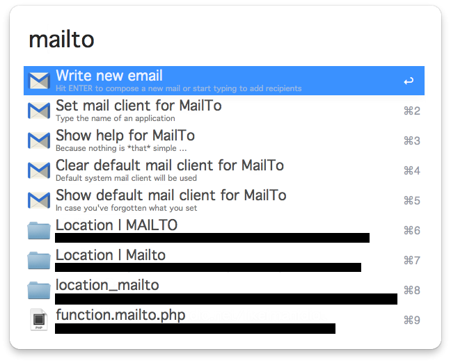
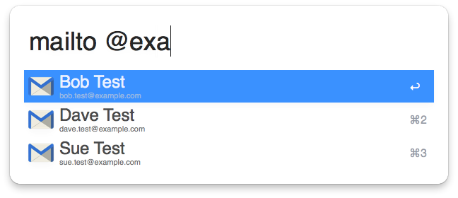
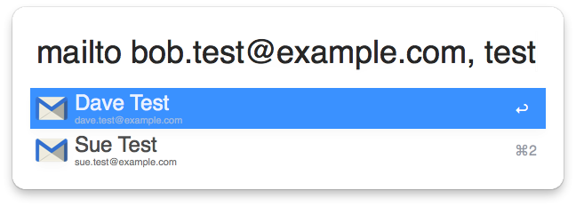
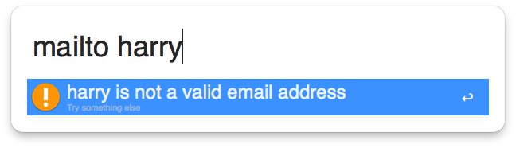
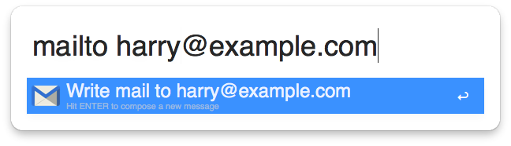
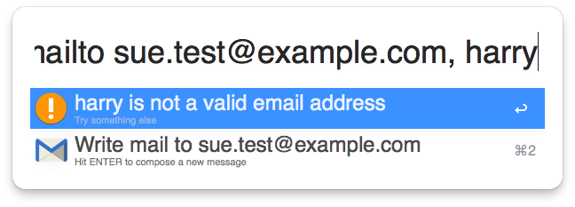

Alfred-MailTo
=============

A Workflow for [Alfred 2](http://www.alfredapp.com/) that allows you to choose from your Mac contacts (or enter email addresses manually) and compose a message using the email app of your choice.

Uses the [alfred-python](https://github.com/nikipore/alfred-python) library by [nikipore](https://github.com/nikipore).

## Usage ##

Open Alfred, type `mailto` (the default keyword) then either hit `ENTER` to open an entirely blank message or start typing the name or email address you'd like to send a mail to.

Addresses will be suggested from matching contacts in your Mac address book. Hit `TAB` to autocomplete the recipient list from the selected result, or `ENTER` or `⌘+NUM` to add the address and start composing a mail.

You can add multiple recipients by adding a comma between them.

## Copyright etc. ##

All code by me in the public domain. No idea about the included [alfred.py](https://github.com/nikipore/alfred-python).

### Icons ###

* Email icon from [Icon Archive](http://www.iconarchive.com/show/plex-icons-by-cornmanthe3rd/Communication-email-2-icon.html)
* Original info icon from [IconsDB](http://www.iconsdb.com/royal-blue-icons/info-icon.html)
* Original warning icon also from [IconsDB](http://www.iconsdb.com/orange-icons/warning-icon.html)

## Screenshots ##

Create an empty message:

Auto-complete addresses from your Contacts by name or by email address:

Add multiple recipients:

Handle unknown recipients and invalid addresses intelligently:

