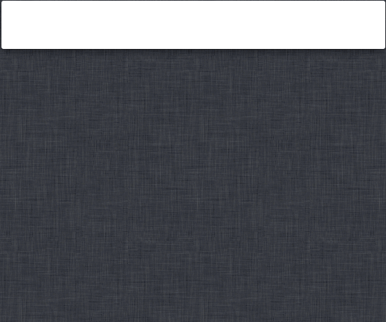

Alfred-MailTo
=============

A Workflow for [Alfred 2][alfred].

Quickly select recipients from your Mac's Contacts database and send them to
your email client of choice. Also works with Groups/Distribution Lists.

## Download and installation [download-and-installation] ##

You can install MailTo either from [GitHub releases][github-releases] or
[the Packal website][packal-page].

Install by double-clicking `MailTo.alfredworkflow`.

## Usage [usage] ##

**Note:** The first time you run MailTo, you will probably be asked to grant
access to your Contacts. Obviously enough, if you refuse access, MailTo won't
work.

Use the `@` keyword in Alfred to access MailTo and search your Mac's Address
Book.

Recipients will be suggested from matching contacts and groups in the
accounts configured in your `Contacts` app (see the [help][help] file for
supported account types).

Hit `⇥` to autocomplete the recipient list from the selected result, or `↩`
or `⌘+NUM` to add the address to the recipient list and start composing a mail.

You can add multiple recipients by adding a comma between them.

Use `mailto` to view/change settings.

See [Help][help] for more information.

## Supported email clients [supported-email-clients] ##

The following email clients currently work "out of the box":

- Apple Mail
- Sparrow
- Thunderbird
- Postbox
- Airmail (email addresses only)
- Unibox
- MailMate
- Mailbox Beta (email addresses only)
- Google Chrome (if you've [set a handler][chrome-handlers])
- Fluid single-session browsers (please see [Help](#help) for
  more information)

## Unsupported clients [unsupported-clients] ##

The following do **not** work:

- Safari (it will open your system default mail client instead)

## Help [help] ##

Further information can be found in the included help file. Use the keyword
`mailto` to open it in your browser or view it online [here][online-help].

## Contribute ##

To report a bug or submit a feature request, please create
[an issue on GitHub][github-issues] or [submit a pull request][github-pulls].

## Thanks, licensing etc. [thanks-licensing-etc] ##

- The MailTo code is released under the [MIT licence][mit-licence].
- MailTo is heavily based on [Alfred-Workflow][alfred-workflow], also
  released under the [MIT licence][mit-licence] and also by [me][deanishe].
- The icons are almost all from [Dave Gandy][dave-gandy]'s
  [Font Awesome][font-awesome] ([SIL Open Font License][sil-licence]) via
  [Seth Lilly][seth-lilly]'s also awesome
  [Font Awesome Symbols for Sketch][font-awesome-sketch]
  ([MIT licence][mit-licence]). Any icons that are not from Font Awesome, you
  may do with as you please.

[alfred]: http://www.alfredapp.com/
[mit-licence]: http://opensource.org/licenses/MIT
[font-awesome]: http://fortawesome.github.io/Font-Awesome/
[font-awesome-sketch]: https://github.com/sethlilly/Font-Awesome-Symbols-for-Sketch
[sil-licence]: http://scripts.sil.org/OFL
[dave-gandy]: http://twitter.com/davegandy
[seth-lilly]: http://twitter.com/sethlilly
[deanishe]: http://twitter.com/deanishe
[alfred-workflow]: https://github.com/deanishe/alfred-workflow/
[github-issues]: https://github.com/deanishe/alfred-mailto/issues
[github-pulls]: https://github.com/deanishe/alfred-mailto/pulls
[online-help]: http://www.deanishe.net/alfred-mailto/
[packal-page]: http://www.packal.org/workflow/mailto
[github-releases]: https://github.com/deanishe/alfred-mailto/releases/latest
[packal-updater]: http://www.packal.org/workflow/packal-updater
[chrome-handlers]: https://support.google.com/chrome/answer/1382847?hl=en
[online-help]: http://www.deanishe.net/mailto/
