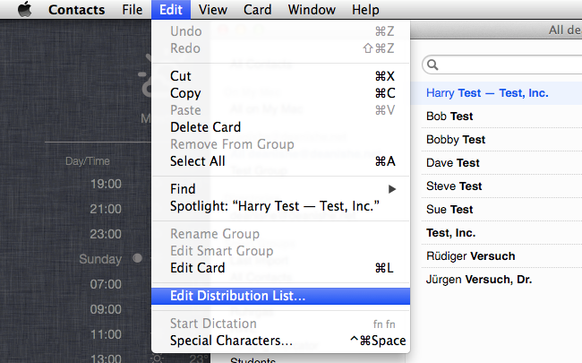

title: MailTo Workflow Help
author: Dean Jackson
date: 2015-07-28

Alfred-MailTo
=============

A Workflow for [Alfred 2][alfred].

Quickly select recipients from your Mac's Contacts database and send
them to your email client of choice. Also works with
Groups/Distribution Lists.

<a name="demo"></a>


## Contents ##

- [Download and installation](#downloadandinstallation)
- [Usage](#usage)
    - [Quickstart](#quickstart)
    - [All options](#alloptions)
- [Email clients](#emailclients)
    - [Supported email clients](#supportedemailclients)
    - [Unsupported clients](#unsupportedclients)
    - [Other clients](#otherclients)
- [Supported account types](#supportedaccounttypes)
    - [Google Contacts](#googlecontacts)
- [Miscellany](#miscellany)
    - [Configuring groups and distribution lists](#configuringgroupsanddistributionlists)
    - [Fluid apps](#fluid-apps)
    - [Roundcube webmail](#roundcubewebmail)
    - [Updates, GitHub and Packal](#updatesgithubandpackal)
- [Bugs, feature requests, suggestions](#bugsfeaturerequestssuggestions)
- [Thanks, licensing etc.](#thankslicensingetc)


## Download and installation ##

You can install MailTo either from [GitHub releases][github-releases]
or [the Packal website][packal-page].

Install by double-clicking `MailTo.alfredworkflow`.


## Usage ##

**Note:** The first time you run MailTo, you will probably be asked to
grant access to your Contacts. Obviously enough, if you refuse access,
MailTo won't work.


### Quickstart ###

Use the `@` keyword in Alfred to access MailTo and search your Mac's
Address Book.

Recipients will be suggested from matching contacts and groups in the
[accounts](#supported-account-types) configured in your Contacts
database.

Hit `⇥` to autocomplete the recipient list from the selected result, or
`↩` or `⌘+NUM` to add the address to the recipient list and start
composing a mail.

You can add multiple recipients by adding a comma between them.

Use `mailto` to view/change settings.


### All options ###

- `@ <query>` — Search your Contacts by name, nickname, email address.
  The search is fairly smart and will match "bs" to "Bob Smith". You
  can also enter email addresses that aren't in your Contacts.
    - `⇥` — Add selected contact to list of recipients and search for
      another contact.
    - `↩` or `⌘+NUM` — Add selected contact to list of recipients and
      send to your email client.
- `mailto [<query>]` — Show, filter and edit configuration.
    - `Version X.X.X is available` — Such a message will be shown
      if a newer version of MailTo is available. `↩` to download and
      install. Please see [Updates, GitHub and
      Packal](#updates--github-and-packal), especially if you use the
      [Packal updater][packal-updater].
    - `Force Reload` — `↩` to force MailTo to update its cache of your
      contacts and email clients on your system. By default, MailTo
      will cache your contacts for one hour and the list of email
      clients on your system for one day.
    - `Email Client: …` — Displays your currently selected email
      client. By default, MailTo uses your default system client, but
      you can change to any app on your system that supports the
      `mailto:` protocol. `↩` to view and search a list of your apps
      and `↩` again to select one.
    - `Format: (Name & Email | Email Only)` — How MailTo sends the
      list of recipients to your email client. Default is `Name &
      Email`, whereby MailTo will use email addresses only if the
      selected client is known not to support names in `mailto:` URIs
      (see [Supported email clients](#supported-email-clients)). `↩` to
      toggle between the two formats.
    - `Update Notifications: (ON | OFF)` — If `ON` (the default),
      MailTo will show a notice of any available update at the top of
      its search results list. If `OFF`, you'll have to go into the
      Configuration (`mailto`) to see if a new version is available.
      `↩` to toggle on/off.
    - `Help Text: (ON | OFF)` — If `ON` (the default), additional help
      text will be shown in the item subtitles in Alfred. Turning off
      will make MailTo look a bit cleaner. `↩` to toggle on/off.
    - `Edit Client Formatting Rules` — Edit the `client_rules.json`
      file where you can add your own rules for a different client or
      override the built-in defaults. See [Other
      clients](#other-clients) for details. `↩` to reveal
      `client_rules.json` in Finder.
    - `View MailTo Help` — `↩` to open the MailTo help file in your
      browser.


## Email clients ##

In *theory*, any email client should work, as MailTo uses a
[`mailto:`][mailto-scheme] URI to call your email client.

In *practice*, support for `mailto:` varies widely between clients.
Pretty much any client will accept a URI containing only email
addresses, but many choke if the URI also contains recipients' names,
e.g. `Bob Jones <bob.jones@example.com>` instead of just
`bob.jones@example.com`.

MailTo knows how to handle all the clients listed below and will
automatically fall back to email addresses only if the client is known
to choke on names.

If your email weapon-of-choice isn't working properly, try forcing
MailTo to use email addresses only (enter `mailto` in Alfred and toggle
`Format` to `Email Only` in MailTo the Configuration), and [file a bug
report][github-issues] or submit a [pull request][github-pulls] if
you've [got it working yourself](#other-clients).


### Supported email clients ###

The following email clients currently work "out of the box":

- Apple Mail
- Sparrow
- Thunderbird
- Postbox
- Airmail (email addresses only)
- Unibox
- MailMate
- Mailbox Beta (email addresses only)
- Google Chrome (if you've [set a handler][chrome-handlers])
- Fluid single-session browsers (see [note](#fluid-apps))


### Unsupported clients ###

The following do **not** work:

- Safari (it will open your system default mail client instead)


### Other clients ###

Anything not listed above hasn't been tested because I don't own a copy
to test with.

If your client doesn't work with the default settings, you can try your
hand at adding rules for that client by editing the `client_rules.json`
file in MailTo's data directory. To access the file, open the
configuration options with `mailto` and select `Edit Client Formatting
Rules`. `client_rules.json` will be revealed in Finder.

The file is well documented, and you can try different combinations of
options to see if you can find one that works with your client. If you
do, please share them in a [GitHub issue][github-issues] or [pull
request][github-pulls] (add the configuration to the default
`client_rules.json` in the `src` directory). A sample configuration
looks like this (this is the default configuration for
[MailMate][mailmate]):

```javascript
{
    "com.freron.MailMate": {
        "spaces": true,
        "names": true,
        "mime": false,
        "no_commas": false,
        "inline_to": false
    },
    // other apps here
    // ...
}
```

**Note:** To configure an app, you must use its bundle ID, not its name
(i.e. `com.freron.MailMate`, not `MailMate`).

You can use MailTo's configuration screen to get the bundle ID of an
application:

1. Use `mailto` to bring up the configuration menu, and choose
   `Email Client: …`. This will display a list off all compatible apps
   on your system.
2. Search or scroll down the list to select the app you want.
3. Hold `⌘` to display its bundle ID as the subtitle or press `⌘+C`
   to copy the bundle ID to the pasteboard. `⌘+L` will also display the
   bundle ID in Alfred's Large Text window.

Alternatively, you can use the following command in Terminal to get the
bundle ID of an application:

```bash
mdls -name kMDItemCFBundleIdentifier -raw /Applications/MailMate.app
# com.freron.MailMate
```


## Supported account types ##

MailTo uses the [official Address Book API][ab-api] to read your
contacts.

The following account types are *definitely* supported:

- Local contacts
- iCloud
- Google (see [below](#google-contacts))
- Facebook
- CardDAV

I don't know about any other account types, as I don't have any to test
with…

Please let [me][deanishe] know if you have a different kind of account,
e.g. Exchange or LDAP, and whether or not it works.


### Google Contacts ###

Groups are currently not synced properly between Google accounts and
Contacts.app. Groups created in Contacts.app in a Google account become
a single, empty contact in your Google Contacts; groups in Google
Contacts are ignored by Contacts.app.

This is a limitation of the Contacts.app–Google Contacts integration,
not of MailTo.

## Miscellany ##

### Configuring groups and distribution lists ###

You can use groups in your Contacts database as mailing lists/distribution
lists. When you add a contact to a group, their primary email address will
be used when you send an email to that group (the primary email is the one
listed first in Contacts.app).

If you'd like to change the email address associated with a group, open
Contacts.app and select the `Edit > Edit Distribution List…` menu item:



Select the group you'd like to edit from the list on the left and then
click on the email addresses you'd like to associate with the group:


In this example, I've associated Jürgen's `versuchgroup@example.com`
email address with the group. If you watch the [demo animation](#demo),
you can see that when I send an email to `Test Group`, that's the
address that's used for Jürgen.


### Fluid apps ###

[Fluid][fluidapp] is an application that turns web applications into
native applications. It generates so-called "single-session browsers",
which are basically browser apps designed to visit only one website.

By default, all Fluid-generated apps can handle `mailto:` URIs (and
will show up in MailTo's list of email clients), but only via Gmail
(which is pre-configured by Fluid).

To add a different webmail service, first you need to figure out the
URL to send the email address(es) to.


#### Roundcube webmail ####

For a [Roundcube][roundcube] installation, it would be something like:

`https://mail.example.com/?_task=mail&_action=compose&to=`

Once you've got your URL, open your Fluid app's Preferences and go to
`URL Handler Preferences`. Add a new group for your webmail service and
add the pattern `mailto:*`. Then copy the JavaScript from the `Gmail >
mailto:*` script box into your own `mailto:*` handler's box. Finally,
change the URL in the `outURLString` line to your own webmail's URL.
For a Roundcube installation, it'd look like this:

```javascript
function transform(inURLString) {
        inURLString = inURLString.replace('mailto:', '');
        inURLString = inURLString.replace('&amp;', '&');

        var argStr = '';
        var splits = inURLString.split('?');

        var emailAddr = null;
        var args = {};
        if (splits.length > 0) emailAddr = splits[0];
        if (splits.length > 1) argStr = splits[1];

        var outURLString = 'https://mail.example.com/?_task=mail&_action=compose&to=' + emailAddr;

        if (argStr.length > 0) outURLString += '&' + argStr;
        return outURLString;
}
```

Don't forget to deactivate (uncheck) the `Gmail` `mailto:*` script!


### Updates, GitHub and Packal ###

MailTo has a built-in updater and will offer to update itself via
GitHub if a newer version is available.

You can [turn off update notifications](#all-options) if you prefer (by
default, MailTo will show an update notification in your results list).

If you use the [Packal Updater][packal-updater], you should turn off
update notifications and leave the updating to the Packal Updater. An
update notification will still be shown in the configuration screen
(keyword `mailto`), but it's much easier to avoid selecting that one by
accident.

Packal adds additional metadata to the workflows it distributes to
enable updates. This metadata is missing in the GitHub version, so the
Packal Updater will no longer update MailTo for you until you reinstall
it from Packal.


## Bugs, feature requests, suggestions ##

Please report any bugs and submit any feature requests via
[GitHub issues][github-issues] or in the thread on the
[Alfred Forum][forum-thread].


## Thanks, licensing etc. ##

- The MailTo code is released under the [MIT licence][mit-licence].
- MailTo is heavily based on [Alfred-Workflow][alfred-workflow], also
  released under the [MIT licence][mit-licence] and also by
  [me][deanishe].
- The icons are almost all from [Dave Gandy][dave-gandy]'s
  [Font Awesome][font-awesome] \([SIL Open Font License][sil-licence]\)
  via [Seth Lilly][seth-lilly]'s also awesome [Font Awesome Symbols for
  Sketch][font-awesome-sketch] \([MIT licence][mit-licence]\). Any
  icons that are not from Font Awesome, you may do with as you please.


[ab-api]: https://developer.apple.com/library/mac/documentation/UserExperience/Conceptual/AddressBook/AddressBook.html
[alfred-workflow]: https://github.com/deanishe/alfred-workflow/
[alfred]: http://www.alfredapp.com/
[chrome-handlers]: https://support.google.com/chrome/answer/1382847?hl=en
[dave-gandy]: http://twitter.com/davegandy
[deanishe]: http://twitter.com/deanishe
[fluidapp]: http://fluidapp.com/
[font-awesome-sketch]: https://github.com/sethlilly/Font-Awesome-Symbols-for-Sketch
[font-awesome]: http://fortawesome.github.io/Font-Awesome/
[forum-thread]: http://www.alfredforum.com/topic/3345-mailto-select-contacts-and-compose-in-your-favourite-email-app/
[github-issues]: https://github.com/deanishe/alfred-mailto/issues
[github-pulls]: https://github.com/deanishe/alfred-mailto/pulls
[github-releases]: https://github.com/deanishe/alfred-mailto/releases/latest
[mailmate]: http://freron.com/
[mailto-scheme]: http://en.wikipedia.org/wiki/Mailto
[mit-licence]: http://opensource.org/licenses/MIT
[packal-page]: http://www.packal.org/workflow/mailto
[packal-updater]: http://www.packal.org/workflow/packal-updater
[roundcube]: http://roundcube.net/
[seth-lilly]: http://twitter.com/sethlilly
[sil-licence]: http://scripts.sil.org/OFL
